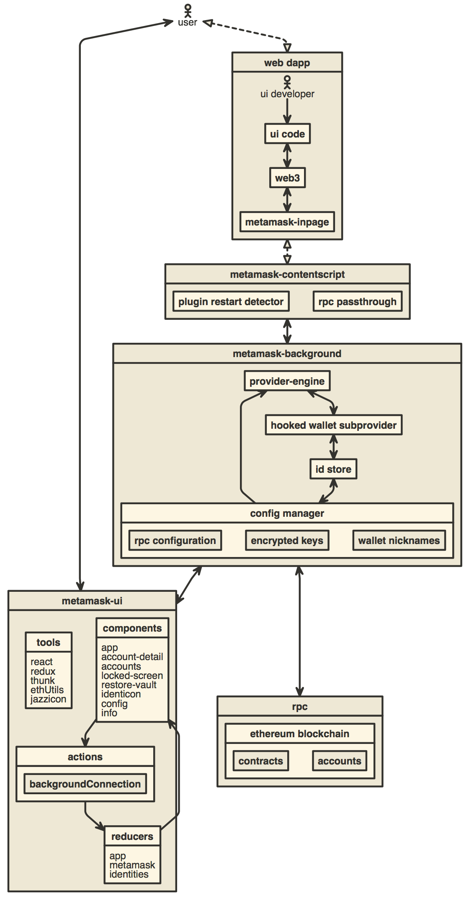

# BORNEO Wallet Browser Extension

## Building locally

- Install [Node.js](https://nodejs.org) version 14
    - If you are using [nvm](https://github.com/creationix/nvm#installation) (recommended) running `nvm use` will automatically choose the right node version for you.
- Install [Yarn](https://yarnpkg.com/en/docs/install)
- Install dependencies: `yarn setup` (not the usual install command)
- Copy the `.metamaskrc.dist` file to `.metamaskrc`
    - Replace the `INFURA_PROJECT_ID` value with your own personal [Infura Project ID](https://infura.io/docs).
    - If debugging MetaMetrics, you'll need to add a value for `SEGMENT_WRITE_KEY` [Segment write key](https://segment.com/docs/connections/find-writekey/).
- Build the project to the `./dist/` folder with `yarn dist`.

Uncompressed builds can be found in `/dist`, compressed builds can be found in `/builds` once they're built.

## Contributing

### Development builds

To start a development build (e.g. with logging and file watching) run `yarn start`.

To start the [React DevTools](https://github.com/facebook/react-devtools) and [Redux DevTools Extension](http://extension.remotedev.io)
  alongside the app, use `yarn start:dev`.
  - React DevTools will open in a separate window; no browser extension is required
  - Redux DevTools will need to be installed as a browser extension. Open the Redux Remote Devtools to access Redux state logs. This can be done by either right clicking within the web browser to bring up the context menu, expanding the Redux DevTools panel and clicking Open Remote DevTools OR clicking the Redux DevTools extension icon and clicking Open Remote DevTools.
    - You will also need to check the "Use custom (local) server" checkbox in the Remote DevTools Settings, using the default server configuration (host `localhost`, port `8000`, secure connection checkbox unchecked)

### Running Unit Tests and Linting

Run unit tests and the linter with `yarn test`.

To run just unit tests, run `yarn test:unit`. To run unit tests continuously with a file watcher, run `yarn watch`.

You can run the linter by itself with `yarn lint`, and you can automatically fix some lint problems with `yarn lint:fix`. You can also run these two commands just on your local changes to save time with `yarn lint:changed` and `yarn lint:changed:fix` respectively.

### Running E2E Tests

Our e2e test suite can be run on either Firefox or Chrome. In either case, start by creating a test build by running `yarn build:test`.

Firefox e2e tests can be run with `yarn test:e2e:firefox`.

Chrome e2e tests can be run with `yarn test:e2e:chrome`, but they will only work if you have Chrome v79 installed. Update the `chromedriver` package to a version matching your local Chrome installation to run e2e tests on newer Chrome versions.

### Changing dependencies

Whenever you change dependencies (adding, removing, or updating, either in `package.json` or `yarn.lock`), there are various files that must be kept up-to-date.

* `yarn.lock`:
  * Run `yarn setup` again after your changes to ensure `yarn.lock` has been properly updated.
* The `allow-scripts` configuration in `package.json`
  * Run `yarn allow-scripts auto` to update the `allow-scripts` configuration automatically. This config determines whether the package's install/postinstall scripts are allowed to run. Review each new package to determine whether the install script needs to run or not, testing if necessary.
  * Unfortunately, `yarn allow-scripts auto` will behave inconsistently on different platforms. macOS and Windows users may see extraneous changes relating to optional dependencies.
* The LavaMoat auto-generated policy in `lavamoat/node/policy.json`
  * Run `yarn lavamoat:auto` to re-generate this policy file. Review the changes to determine whether the access granted to each package seems appropriate.
  * Unfortunately, `yarn lavamoat:auto` will behave inconsistently on different platforms. macOS and Windows users may see extraneous changes relating to optional dependencies.

## Architecture

[][1]

## Development

```bash
yarn
yarn start
```

## Build for Publishing

```bash
yarn dist
```

## Other Docs

- [How to add custom build to Chrome](./docs/add-to-chrome.md)
- [How to add custom build to Firefox](./docs/add-to-firefox.md)
- [How to add a new translation to MetaMask](./docs/translating-guide.md)
- [Publishing Guide](./docs/publishing.md)
- [How to use the TREZOR emulator](./docs/trezor-emulator.md)
- [How to generate a visualization of this repository's development](./development/gource-viz.sh)

